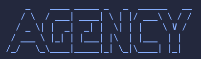

<div align="center">



**A terminal-native session manager for AI coding agents.**

Run Claude Code, Codex, Gemini, and any CLI agent simultaneously in a tiled tmux grid — with everything visible at once, keyboard-driven, and zero overhead.

<!-- Replace with a real badge row once the repo is public -->
<!--    -->

</div>

---

<video src="assets/agency_demo.mp4" controls width="100%"></video>

---

## What is this?

Agency turns your terminal into a Bloomberg-style multi-agent workstation. Every pane stays on screen in a tiled grid — no tabs, no alt-tabbing, no context switching. Spawn agents in specific project directories with a single keypress, kill them just as fast, and let them self-spawn sibling panes over a unix socket while they work.

Each pane gets a unique color and a bold `agent@folder` label in its border, so you always know what's running where.

---

## Features

- **Everything on screen at once** — tiled grid layout, auto-rebalances on every spawn
- **Per-pane color labels** — every pane gets a unique color and a `claudejail@myapp` style border label
- **Directory-aware spawning** — `agency spawn claude ~/projects/api ~/projects/frontend` opens one pane per directory
- **Glob support** — `agency spawn claude ~/projects/client-*` expands via your shell
- **Agent self-spawning** — agents call `agency-spawn claude` from inside a pane to request new sibling panes
- **Spawn dialog** — `Prefix+2/3/4/5` opens a directory picker pre-filled with the current pane's path
- **Command palette** — `Prefix+c` fuzzy-searches all configured agent types
- **Crash recovery** — if agency restarts, it re-adopts existing tmux panes automatically
- **Isolated tmux config** — agency manages its own `tmux.conf`, never touches your `~/.tmux.conf`
- **Catppuccin Mocha theme** — inline, no plugin dependencies

---

## Requirements

- **Go 1.22+** (to build)
- **tmux 3.5+** (for per-pane colored borders — see install instructions below)
- At least one agent CLI: `claude`, `codex`, `gemini`, or any command you like
- `socat` or `nc` for the agent self-spawn script

### Installing tmux 3.5+

The version in most distro package managers (Ubuntu ships 3.2a, even in 24.04) is too old for per-pane border colors. Build from source — it takes about two minutes:

```bash
# Install build dependencies
sudo apt install -y build-essential libevent-dev libncurses-dev \
  autoconf automake pkg-config bison

# Download and build (check https://github.com/tmux/tmux/releases for the latest tag)
TMUX_VERSION=3.5a
curl -sL "https://github.com/tmux/tmux/releases/download/${TMUX_VERSION}/tmux-${TMUX_VERSION}.tar.gz" \
  | tar xz
cd tmux-${TMUX_VERSION}
./configure && make -j$(nproc) && sudo make install

# Verify — should show 3.5a or newer
tmux -V
```

> If `tmux -V` still reports the old version, make sure `/usr/local/bin` comes before `/usr/bin` in your `$PATH`:
> ```bash
> echo 'export PATH="/usr/local/bin:$PATH"' >> ~/.zshrc && source ~/.zshrc
> ```

After upgrading, kill any running tmux server so it picks up the new binary:

```bash
tmux kill-server
```

---

## Install

```bash
git clone https://github.com/lemonsaurus/agency
cd agency
make install          # builds and copies to ~/.local/bin/
```

Or just build locally:

```bash
make build            # produces ./bin/agency
```

---

## Quick start

```bash
agency                            # launch (creates a new tmux session, or reattaches)
```

Inside the session, use `Prefix+c` (`Ctrl+Space, c`) to open the command palette and pick an agent type. Or use the number keys:

| Shortcut | Action |
|---|---|
| `Prefix+1` | New plain terminal (in current pane's directory) |
| `Prefix+2` | Spawn claudejail (opens directory picker) |
| `Prefix+3` | Spawn claude |
| `Prefix+4` | Spawn codex |
| `Prefix+5` | Spawn gemini |
| `Prefix+c` | Command palette (all agent types) |

---

## CLI reference

```
agency                              Launch session (or reattach if one exists)
agency spawn <agent> [dir...]       Spawn one pane per directory
agency spawn --cmd "htop" [dir]     Spawn an arbitrary command
agency kill <pane-id>               Kill a specific pane
agency kill-all                     Kill all managed panes
agency list                         List all panes
agency layout <name>                Switch layout (tiled, columns, rows, main-vertical)
agency attach                       Reattach to a running session
agency config                       Print resolved config
agency logs                         Print path to the log file (tail -f it)
agency help                         Show help
```

You can also spawn multiple agents across many directories in one shot:

```bash
# One claude pane per client directory
agency spawn claude ~/projects/client-*/

# Three codex panes, explicit paths
agency spawn codex ~/api ~/frontend ~/infra
```

---

## Keyboard shortcuts

The tmux prefix is **`Ctrl+Space`**.

### Spawning

| Shortcut | Action |
|---|---|
| `Prefix+c` | Command palette |
| `Prefix+1` | New terminal |
| `Prefix+2–5` | Spawn agent (opens directory picker) |

### Navigation

| Shortcut | Action |
|---|---|
| `Prefix+Arrow` | Move focus between panes |
| `Prefix+Shift+Arrow` | Resize pane |
| Click | Focus pane (mouse enabled) |
| Scroll | Scroll pane history |

### Layout

| Shortcut | Action |
|---|---|
| `Prefix+=` | Tiled grid (even distribution) |
| `Prefix+\|` | All columns (ultrawide mode) |
| `Prefix+-` | All rows stacked |
| `Prefix+m` | Main pane left, stacked right |
| `Prefix+Space` | Cycle through layouts |

### Management

| Shortcut | Action |
|---|---|
| `Prefix+x` | Kill focused pane (with confirmation) |
| `Prefix+q` | Kill session (Enter or y to confirm) |
| `Prefix+f` | Zoom/unzoom focused pane |
| `Prefix+b` | Broadcast — type in all panes at once |
| `Prefix+r` | Respawn dead pane |
| `Prefix+d` | Detach (session keeps running) |

---

## How agent self-spawning works

When agency launches it starts a unix socket server at `/tmp/agency-{session}.sock` and exports `AGENCY_SOCKET` into every pane's environment.

The `agency-spawn` script (installed to `~/.local/bin/`) is a tiny wrapper agents can call:

```bash
agency-spawn claude                      # spawn a claude pane in the current directory
agency-spawn claude --dir ~/projects/api # spawn in a specific directory
agency-spawn --cmd "aider --yes"         # spawn an arbitrary command
```

A Claude Code agent given instructions like *"when you need to work on the backend, run `agency-spawn claude --dir ~/api`"* will request a new sibling pane over the socket. Agency receives the message, spawns the pane, and re-tiles the grid — all without leaving the terminal.

The protocol is plain text over the unix socket:

```
spawn:claude@/home/user/projects/api    → spawn agent pane in that directory
spawn:cmd:htop                          → spawn arbitrary command
kill:%3                                 → kill pane %3
layout:tiled                            → switch layout
```

---

## Config

Agency looks for `~/.config/agency/config.toml`. If it doesn't exist, built-in defaults are used. Copy `configs/default.toml` as a starting point:

```bash
mkdir -p ~/.config/agency
cp configs/default.toml ~/.config/agency/config.toml
```

```toml
[session]
name = "agency"
default_layout = "tiled"         # tiled | columns | rows | main-vertical

[theme]
active_border = "#89b4fa"
inactive_border = "#45475a"
status_bg = "#181825"
status_fg = "#cdd6f4"

[agents.claudejail]
command = "claudejail"
icon = "🔒"
border_color = "#f38ba8"

[agents.claude]
command = "claude"
icon = "🤖"
border_color = "#cba6f7"

# Add your own agent types:
# [agents.aider]
# command = "aider --model ollama_chat/gemma3"
# icon = "🔧"
# border_color = "#a6e3a1"
```

Agents are assigned to the number keys (`Prefix+2` through `Prefix+5`) in the order they appear in the config file.

---

## Pane labels

Each pane gets a top-border label in the format `agent@folder`:

```
 🔒 claudejail@api   🤖 claude@frontend   🧠 codex@infra
```

- The label background color is unique per pane, cycling through a 12-color palette
- Plain terminal panes (spawned with `Prefix+1`) show `zsh@currentfolder` and update live as you `cd`
- Labels are stored as tmux pane options (`@agency_label`) so they survive application title changes

---

## Troubleshooting

**Pane borders are all the same color**
You need tmux 3.4+ for per-pane `pane-border-style`. On older versions the colored badge in the top border status bar still shows per-pane colors; only the border lines themselves won't differ. See [Installing tmux 3.5+](#installing-tmux-35) above.

**`agency spawn` types into the current pane instead of opening a new one**
This means agency isn't running (`AGENCY_SOCKET` isn't set or the socket server isn't listening). Start a session first with `agency`, then spawn from a pane inside it.

**Command palette / spawn dialog doesn't appear**
`display-popup` requires tmux 3.2+. Also verify `agency` is in your `$PATH` — the keybindings call it by name.

**Check the logs**
```bash
tail -f $(agency logs)
```

---

## Development

```bash
make build      # compile
make install    # build + install to ~/.local/bin/
go test ./...   # run tests
go vet ./...    # static analysis
```

See `CLAUDE.md` for the full architecture spec and development guidelines.
