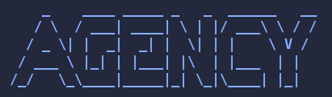

<div align="center">



*a beautiful terminal multiplexer grid for color coded agent sessions*

   
</div>

---

https://github.com/user-attachments/assets/0ddf6f56-4c13-4603-a85e-6e95914c4184

---

## Install

```bash
curl -fsSL https://raw.githubusercontent.com/lemonsaurus/agency/main/install.sh | bash
```

This handles everything — installs tmux 3.5+ (building from source if your distro's version is too old), Go 1.24+, and agency itself. Sudo is only used for system-level installs (`apt`, `/usr/local`); everything else runs as your user.

You'll also need at least one agent CLI: `claude`, `codex`, `gemini`, `pi`, or any command you like.

<details>
<summary>Manual install</summary>

#### Requirements

- **Go 1.24+**
- **tmux 3.5+** (most distros ship an older version — Ubuntu 24.04 has 3.2a)
- `socat` or `nc` for the agent self-spawn script

#### Building tmux 3.5+ from source

```bash
sudo apt install -y build-essential libevent-dev libncurses-dev \
  autoconf automake pkg-config bison

TMUX_VERSION=3.5a
curl -sL "https://github.com/tmux/tmux/releases/download/${TMUX_VERSION}/tmux-${TMUX_VERSION}.tar.gz" \
  | tar xz
cd tmux-${TMUX_VERSION}
./configure && make -j$(nproc) && sudo make install
tmux -V   # should show 3.5a or newer
```

> If `tmux -V` still reports the old version, make sure `/usr/local/bin` comes before `/usr/bin` in your `$PATH`.

After upgrading, kill any running tmux server so it picks up the new binary: `tmux kill-server`

#### Building agency

```bash
git clone https://github.com/lemonsaurus/agency
cd agency
make install          # builds and copies to ~/.local/bin/
```

</details>

---

## What is this?

Agency turns your terminal into a Bloomberg-style multi-terminal workstation. Every pane stays on screen in a tiled grid — no tabs, no alt-tabbing, no context switching. Designed for giant ultrawide monitor nerds who are trying to juggle and keep track of 10+ terminal sessions.

Each pane gets a unique color and its folder name in the top border. A separate task label appears in Pi's input badge. Hotkeys start pi, claudejail, codex and gemini sessions.

<sub>PS: This is not really appropriate for a small monitor - for that use case, maybe check out [agent deck](https://github.com/asheshgoplani/agent-deck).</sub>

---

## Features

- **Everything on screen at once** — tiled grid layout, auto-rebalances on every spawn
- **Per-pane labels**: colored folder borders and editable task labels that survive restarts and handoffs
- **Directory-aware spawning** — `agency spawn claude ~/projects/api ~/projects/frontend` opens one pane per directory
- **Glob support** — `agency spawn claude ~/projects/client-*` expands via your shell
- **Bounded delegation**: controllers create managers, managers create workers, workers cannot spawn
- **Spawn dialog** — `Prefix+2/3/4/5` opens a directory picker pre-filled with the current pane's path
- **Command palette** — `Prefix+c` fuzzy-searches all configured agent types
- **Crash recovery** — if agency restarts, it re-adopts existing tmux panes automatically
- **Isolated tmux config** — agency manages its own `tmux.conf`, never touches your `~/.tmux.conf`
- **Catppuccin Mocha theme** — inline, no plugin dependencies


---

## Quick start

```bash
agency                            # launch (creates a new tmux session, or reattaches)
```

Inside the session, use `Prefix+c` (`Ctrl+Space, c`) to open the command palette and pick an agent type. Or use the number keys:

| Shortcut | Action |
|---|---|
| `Prefix+1` | New plain terminal (in current pane's directory) |
| `Prefix+2` | Spawn pi (opens directory picker) |
| `Prefix+3` | Spawn claudejail |
| `Prefix+4` | Spawn codex |
| `Prefix+5` | Spawn gemini |
| `Prefix+c` | Command palette (all agent types) |

---

## CLI reference

```
agency                              Launch session (or reattach if one exists)
agency --migrate-controller <pane>   Migrate a legacy session under the selected controller
agency spawn <agent> [dir...]       Spawn one pane per directory
agency spawn --cmd "htop" [dir]     Spawn an arbitrary command
agency spawn --role <role> --label "task" ...  Programmatic manager or worker spawn
agency label [--pane %N]             Read a pane's task label
agency label [--pane %N] -- "task"    Set a pane's task label (empty clears)
agency whoami [--role]               Print current pane authority
agency capabilities                 Print running daemon protocol and promotion shortcut
agency replace [--cmd "..." dir]     Start a role-preserving successor
agency request-promotion <reason>    Request worker promotion
agency approve-promotion <pane>      Approve promotion (human tmux authority only)
agency kill <pane-id>               Kill a specific pane
agency kill-all                     Kill all managed panes
agency list                         List all panes
agency layout <name>                Switch layout (tiled, columns, rows, main-vertical)
agency attach                       Reattach to a running session
agency serve                        Headless daemon on its own tmux server (the cloud box)
agency cloud <command> ...          Run a CLI command against the headless server (over SSH)
agency sync-cloud                   Mirror the cloud host's panes into the cloud-harness window
agency config                       Print resolved config
agency logs                         Print path to the log file (tail -f it)
agency help                         Show help
```

You can also spawn multiple agents across many directories in one shot:

```bash
# One claude pane per client directory
agency spawn claude ~/projects/client-*/

# Three codex panes, explicit paths
agency spawn codex ~/api ~/frontend ~/infra
```

---

## Keyboard shortcuts

The tmux prefix is **`Ctrl+Space`**.

### Spawning

| Shortcut | Action |
|---|---|
| `Prefix+c` | Command palette |
| `Prefix+1` | New terminal |
| `Prefix+2–5` | Spawn agent (opens directory picker) |

### Navigation

| Shortcut | Action |
|---|---|
| `Prefix+Arrow` | Move focus between panes |
| `Prefix+Shift+Arrow` | Resize pane |
| Click | Focus pane (mouse enabled) |
| Scroll | Scroll pane history |

### Layout

| Shortcut | Action |
|---|---|
| `Prefix+=` | Tiled grid (even distribution) |
| `Prefix+\|` | All columns (ultrawide mode) |
| `Prefix+-` | All rows stacked |
| `Prefix+m` | Main pane left, stacked right |
| `Prefix+Space` | Cycle through layouts |

### Management

| Shortcut | Action |
|---|---|
| `Prefix+x` | Kill focused pane (with confirmation) |
| `Prefix+q` | Kill session (Enter or y to confirm) |
| `Prefix+f` | Zoom/unzoom focused pane |
| `Prefix+b` | Broadcast — type in all panes at once |
| `Prefix+P` | Confirm the focused worker's pending promotion |
| `Prefix+r` | Respawn dead pane |
| `Prefix+d` | Detach (session keeps running) |

---

## How delegation works

Agency assigns three pane roles:

- `controller`: human-created, creates managers
- `manager`: creates workers
- `worker`: cannot create panes

Tmux keybindings and popups carry human authority rather than focused-pane authority. New sessions name the first window `control`; default human spawns create controllers there. Agent spawns require an explicit child role and a descriptive task label. `agency-spawn` derives the role from the caller's live authority and accepts `--label`.

Role, parent, root, pending promotion, and task labels live in tmux pane options for restart adoption. `agency replace` starts a successor in the same window and directory, with optional command and directory overrides for context handoff. It preserves the task label, transfers children, and returns the successor pane ID. The old pane stays alive until the caller checks the successor and retires itself.

Workers request promotion with `agency request-promotion <reason>`. A yellow pane badge marks the pending request. Focus that pane, press `Ctrl+Space`, then `Shift+P`, and confirm with `y`. Approval changes the worker to a manager under its root controller and moves it to its former manager's window. Pi refreshes its tools on the next prompt. Managers cannot become controllers through promotion.

Every role can use `/handoff` without promotion. Failed handoffs keep the original pane and pending input. `agency capabilities` reports the running daemon protocol, configured approval shortcut, and `paneLabels: true`; Pi reports outdated runtimes explicitly.

Agency's API rejects approval from agent processes. The keyboard flow uses tmux process ancestry and human confirmation. Agents with unrestricted shell access are not sandboxed from the tmux server.

For an existing two-role session, stop the old Agency backend without killing the tmux session, then launch `agency --migrate-controller <root-pane>`. The selected root manager becomes the controller. Other roles remain unchanged, other root managers become its children, and worker roots point to it. Legacy workers attached directly to the controller can request promotion. New spawns follow controller → manager → worker.

## Task labels

```bash
agency spawn --role manager --label 'Cloud Harness Setup' pi ~/git/agency
agency label                                  # current pane, plain stdout
agency label --pane %7                        # another pane
agency label -- 'Cloud Harness Setup'         # edit current pane
agency label --pane %7 -- 'Cloud Harness Setup'
agency label -- ''                            # clear current label
```

Labels are single-line text, at most 100 Unicode code points, without control characters or Unicode line/paragraph separators. Every programmatic spawn requires a nonblank label; human keybindings and popups can create unnamed panes. Workers can edit their own label. Managers and controllers can edit any pane. All roles can read labels.

`agency label` identifies the caller through authenticated process ancestry. Reads print the label, or nothing when unset. Writes are silent. `agency list --json` includes an optional `taskLabel`. Pi's `/label` command edits the input badge; folder borders remain separate.

Task labels use `@agency_task_label`; folder borders use `@agency_label`. Both survive daemon restarts. Replacement panes inherit their task label and show the replacement directory in their border.

## Cloud panes

With `[cloud] host` set, launch and `agency sync-cloud` mirror every pane on the host's `agency serve` into a local `cloud-harness` window. Each local pane is a viewer: an SSH attachment to one remote window that reconnects after a dropped link and exits when the remote pane is gone. The remote server keeps one agent per window, has no prefix or status bar, and sizes each window to the client that typed last. Wheel scroll uses the remote scrollback.

Cloud viewers mirror the remote task label and remote folder name. Label writes targeting a local viewer route to its remote pane after the local role check. Sync refreshes edits made on the host.

From a viewer, the spawn keys and palette create the agent on the host in that pane's directory, `Prefix+x` kills the remote agent, `Prefix+r` reconnects the view, and `Prefix+P` approves the remote worker. The pane menu has a separate Close View. On the host, requests from outside every pane carry human authority: only your SSH key reaches it, and agents live in panes.

When agency launches it starts a unix socket server at `/tmp/agency-{session}.sock` and exports `AGENCY_SOCKET` into every pane's environment.

The `agency-spawn` script (installed to `~/.local/bin/`) is a tiny wrapper agents can call:

```bash
agency-spawn claude --label 'Review API'   # spawn in the current directory
agency-spawn claude --label 'Fix API' --dir ~/projects/api
agency-spawn --cmd "aider --yes" --label 'Fix API' # arbitrary command
agency-spawn --replace                    # start a role-preserving successor
agency-spawn --request-promotion "reason" # ask the root controller for promotion
```

Controllers request managers, managers request workers, and workers receive an error. Worker-to-manager delegation policy belongs in the agent instructions, not Agency.

The protocol is plain text over the unix socket:

```
spawn-role:{"agent":"pi","role":"worker","label":"Review API"} → programmatic spawn
label:{}                                     → read caller's label as a JSON string
label:{"pane":"%3","label":"Review API"}      → set label (empty string clears)
replace:{"command":"handoff-pi","dir":"/tmp"} → role-preserving successor
promotion-request:{"reason":"need fanout"} → worker promotion request
promotion-approve:%3                         → human promotion approval
kill:%3                                      → kill pane %3
layout:tiled                                 → switch layout
```

---

## Config

Agency looks for `~/.config/agency/config.toml`. If it doesn't exist, built-in defaults are used. Copy `configs/default.toml` as a starting point:

```bash
mkdir -p ~/.config/agency
cp configs/default.toml ~/.config/agency/config.toml
```

```toml
[session]
name = "agency"
default_layout = "tiled"         # tiled | columns | rows | main-vertical
max_panes = 32
max_managers = 12
max_workers_per_manager = 8

[theme]
active_border = "#89b4fa"
inactive_border = "#45475a"
status_bg = "#181825"
status_fg = "#cdd6f4"

[agents.claudejail]
command = "claudejail"
icon = "🔒"
border_color = "#f38ba8"

[agents.claude]
command = "claude"
icon = "🤖"
border_color = "#cba6f7"

# Add your own agent types:
# [agents.aider]
# command = "aider --model ollama_chat/gemma3"
# icon = "🔧"
# border_color = "#a6e3a1"
```

Agents are assigned to the number keys (`Prefix+2` through `Prefix+5`) in the order they appear in the config file.

---

## claudejail — sandboxed Claude Code

Agency ships two sandbox wrappers — one for Linux, one for macOS.

### claudejail (Linux)

Runs Claude Code inside a [bubblewrap](https://github.com/containers/bubblewrap) sandbox. Restricts Claude's filesystem access to **only the current working directory**. Bubblewrap uses unprivileged user namespaces — no SUID root, no kernel modules. Works reliably on WSL2.

What the sandbox does:

- **Starts with an empty `$HOME`**, then bind-mounts only `$PWD` (read-write), `~/.claude` (read-write), and the `claude` binary (read-only)
- **Drops all Linux capabilities**
- **Isolates PID, IPC, and UTS namespaces**
- **Private `/tmp` and `/dev`**
- **Read-only system directories** (`/usr`, `/bin`, `/lib`, `/etc`)
- **Bind-mounts `~/.nvm`, `~/.gitconfig`, `~/.ssh`** read-only (if they exist)
- **Allows network access** (Claude needs the Anthropic API)
- **Allows subprocess execution** (Claude needs git, npm, bash, etc.)
- **Dies with parent** — sandbox is cleaned up if agency exits

```bash
# Install bubblewrap if you don't have it
sudo apt install bubblewrap

# Install the claudejail script
make install-claudejail
```

This copies one file:

- `~/.local/bin/claudejail` — the wrapper script (sandbox config is inline)

### claudejail-mac (macOS)

Runs Claude Code inside a Docker container. Bubblewrap is Linux-only, so this is the macOS equivalent. Requires [Docker Desktop](https://docs.docker.com/desktop/install/mac-install/).

What the sandbox does:

- **Mounts only `$PWD`** into the container — Claude cannot see the rest of your home directory
- **Mounts `~/.claude`** so Claude retains its config, memory, and auth across sessions
- **Allows network access** (Claude needs the Anthropic API)
- **Allows subprocess execution** (Claude needs git, npm, bash, etc.)
- **Uses permissive Claude settings** so long unattended sessions don't stall waiting for permission prompts

The Docker image is built automatically on first run (~1 min).

```bash
make install-claudejail-mac
```

This copies one file:

- `~/.local/bin/claudejail-mac` — the wrapper script

The one-liner installer (`curl ... | bash`) handles this automatically on macOS.

---

Then just use either wrapper anywhere you'd use `claude`:

```bash
cd ~/projects/myapp
claudejail                    # Linux
claudejail-mac                # macOS
```

Inside agency, `claudejail` is the default `Prefix+3` agent (Linux) and `claudejail-mac` is available on macOS. The source files live in `scripts/claudejail` and `scripts/claudejail-mac`.

---

## Pane labels

Each pane gets a top-border label in the format `agent@folder`:

```
 🔒 claudejail@api   🤖 claude@frontend   🧠 codex@infra
```

- The label background color is unique per pane, cycling through a 12-color palette
- Plain terminal panes (spawned with `Prefix+1`) show `zsh@currentfolder` and update live as you `cd`
- Labels are stored as tmux pane options (`@agency_label`) so they survive application title changes

---

## Troubleshooting

**Pane borders are all the same color**
You need tmux 3.4+ for per-pane `pane-border-style`. On older versions the colored badge in the top border status bar still shows per-pane colors; only the border lines themselves won't differ. See [Installing tmux 3.5+](#installing-tmux-35) above.

**`agency spawn` types into the current pane instead of opening a new one**
This means agency isn't running (`AGENCY_SOCKET` isn't set or the socket server isn't listening). Start a session first with `agency`, then spawn from a pane inside it.

**Command palette / spawn dialog doesn't appear**
`display-popup` requires tmux 3.2+. Also verify `agency` is in your `$PATH` — the keybindings call it by name.

**Check the logs**
```bash
tail -f $(agency logs)
```

---

## Development

Work directly on `main`. Don't create feature branches, worktrees, or pull requests. Start with a clean checkout; if it isn't clean, finish or resolve that work first. Commit every finished change and push `main`. Don't leave dirty files behind.

```bash
make build      # compile
make install    # build + install to ~/.local/bin/
make uninstall  # remove all installed binaries
go test ./...   # run tests
go vet ./...    # static analysis
```

To test the installer against your local checkout instead of cloning from GitHub:

```bash
REPO_DIR=$(pwd) bash install.sh
```

See `CLAUDE.md` for the full architecture spec and development guidelines.
